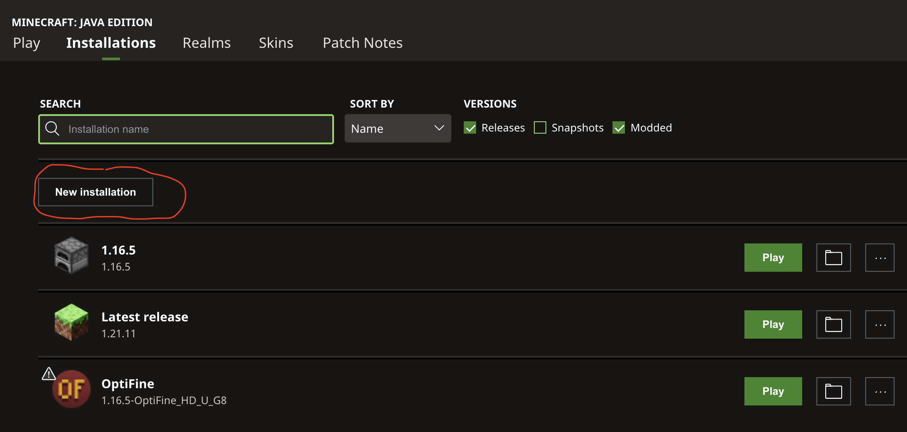
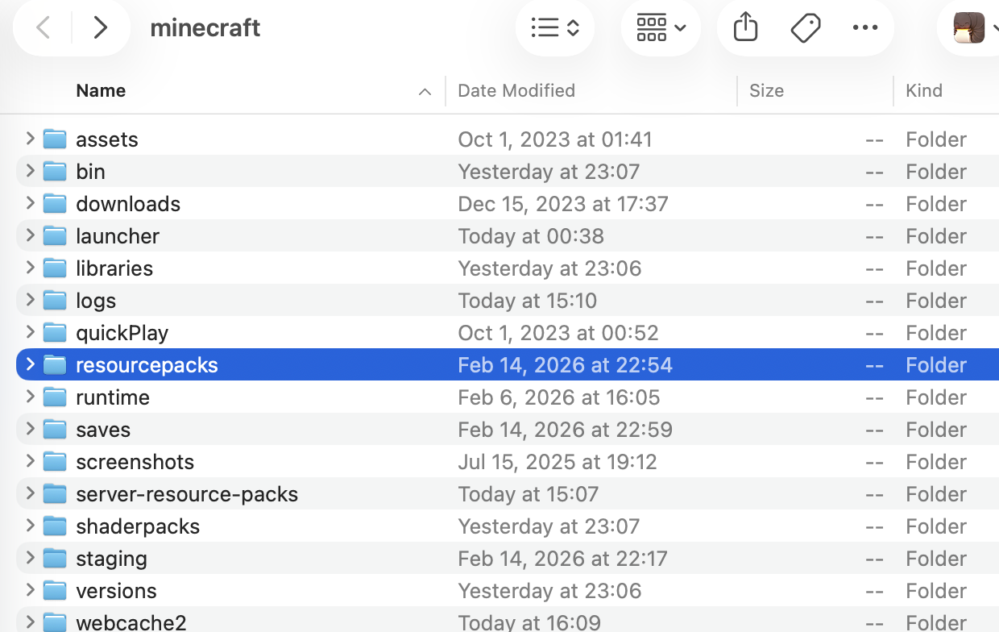

# Witchcraft and Wizardry in Russian

This is a Russian version of popular Minecraft map Witchcraft and Wizardry. Now this map is fully translated in Russian. 

Original repo location <https://github.com/zeinlol/Witchcraft-and-Wizardry-in-Russian.git>

This repo contains only resource packs required to play Witchcraft and Wizardry ru version map on my mc.lzadm.com minecraft server

You need download resourcepack zip file <https://media.githubusercontent.com/media/slawa-c/minecraft-server-java/8263580ecef21f3f0f9ee99da2db0b174ee4a0f2/v1.16.5/Maps/resourcepacks/witchcraft-and-wizardy-ru-resources.zip> and move it to your Minecraft client resource pack folder. before join to server you need to load resource pack in your client.

This map is compatible only with v1.16.5 of Minecraft Java edition, so you need to install it before join server, see Pic1 

then click on Folder button and it will open Mincraft folder location to put resource file, see Pic2 
